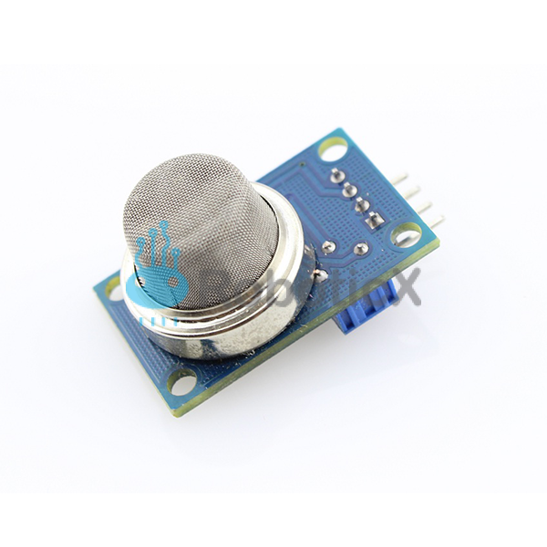
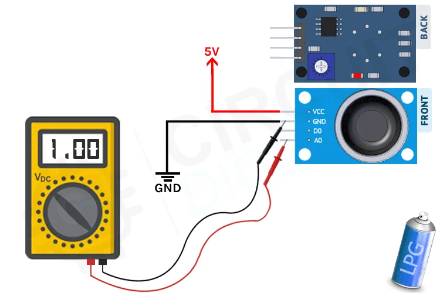
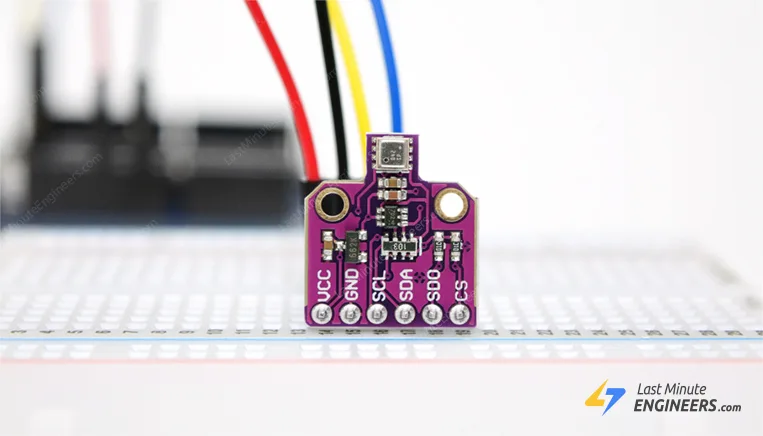

# Hardware Components

## Table of Contents
- [MQ-5 Gas Sensor](#mq-5-gas-sensor)
- [BME680 - Environment Sensor](#bme680---environment-sensor)

---

This section describes the main hardware components used in the proposed gas leakage detection system. Each component is selected based on availability, suitability for HVAC environments, and compatibility with low-cost embedded systems.

---

## MQ-5 Gas Sensor

  

### Purpose and Function

The MQ-5 sensor is designed to detect combustible gases, with high sensitivity to:
- LPG (propane and butane)
- Natural gas
- Other flammable hydrocarbons

  

### Why LPG

In Palestine, **Liquefied Petroleum Gas (LPG)** is one of the most commonly used fuels for household energy applications, including cooking and space heating. Due to the limited availability of a unified natural gas distribution network, LPG cylinders and tanks are widely used in residential and commercial buildings. This makes LPG leakage detection particularly relevant for HVAC heating systems in the local context.

### Why MQ-5 for LPG Detection

The MQ-5 sensor is selected because:
- It is specifically designed to detect **LPG**, which is commonly used as a heating fuel
- It provides an **analog output**, suitable for threshold-based detection
- It is low-cost, widely available, and easy to interface with microcontrollers
- It is appropriate for **early-warning gas leak detection**, which aligns with the project’s goals

### Reference

- Palestinian Central Bureau of Statistics (PCBS), *Household Energy Use Survey*, indicating LPG as a primary household fuel in Palestine.  
  https://www.pcbs.gov.ps/Downloads/book1767.pdf

## BME680 - Environment Sensor

  

### Purpose and Function

The **BME680** is used as a supporting environmental sensor to monitor:
- Ambient temperature
- Relative humidity
- Air quality (VOC levels)
- Air Pressure 