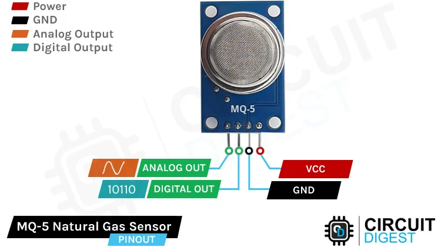
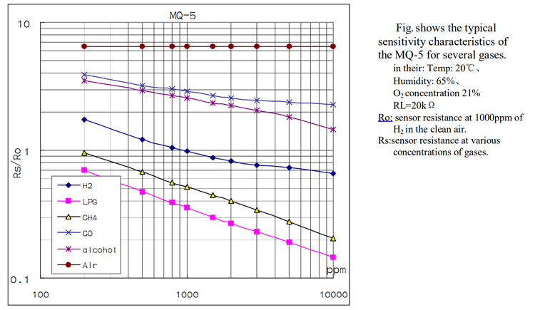

# MQ5 Sensor
This is a summary for the reference bellow, rephrased by CHATGPT, reading this is not sufficient, this is just a way to help fast access to info after reading the main reference [HERE](https://circuitdigest.com/microcontroller-projects/interfacing-mq5-gas-sensor-with-arduino)

## 1. Overview
The **MQ-5** is a low-cost **combustible gas sensor** designed to detect gases such as:

- LPG (propane, butane)
- Methane (CH₄)
- Hydrogen (H₂)
- Carbon monoxide (CO)

It is widely used in **gas leakage detection**, **safety alarms**, and **environment monitoring** systems.  
By default, the MQ-5 provides **relative gas concentration readings**, not precise ppm values, unless properly calibrated.

---

## 2. Operating Principle
The MQ-5 sensor is based on a **heated metal-oxide semiconductor (MOS)** sensing element made of **tin dioxide (SnO₂)**.

- A built-in **heater coil** raises the sensing element temperature.
- In clean air, the sensor resistance (**Rs**) is high.
- When combustible gas is present, gas molecules react with oxygen ions on the sensor surface.
- This reaction **reduces Rs**, causing a change in output voltage.

**Key relationship:**

Higher gas concentration → Lower sensor resistance → Higher analog output voltage

---

## 3. Module Outputs
Most MQ-5 modules expose **two outputs**:

### 3.1 Analog Output (AOUT)
- Provides a **continuous voltage** proportional to gas concentration.
- Connected to an MCU **ADC pin** (e.g., Arduino `A0`).
- Used for:
  - Monitoring gas level trends
  - Implementing custom thresholds
  - Calibration-based ppm estimation

### 3.2 Digital Output (DOUT)
- Output of an onboard **comparator (LM393)**.
- Triggers **HIGH/LOW** when gas concentration exceeds a preset threshold.
- Threshold is adjusted using an **onboard potentiometer**.
- Suitable for simple alarms (no ADC required).

  

---

## 4. Pin Description
| Pin | Description |
|----|------------|
| VCC | Power supply (5 V required) |
| GND | Ground |
| AOUT | Analog voltage output |
| DOUT | Digital threshold output (optional) |

---

## 5. Power & Heating Requirements
- **Supply voltage:** 5 V (mandatory for heater operation)
- **Current consumption:** relatively high due to heater (~150–200 mA)
- **Not suitable for low-power battery operation** without power management

---

## 6. Warm-Up and Stabilization
The MQ-5 requires **preheating** before reliable readings:

- Initial burn-in: **minutes to hours** (for stable baseline)
- Short-term warm-up (every power cycle): **1–3 minutes**

During warm-up, readings are unstable and **must be ignored**.

---

## 7. Detection Range
Typical sensitivity range (approximate, gas-dependent):

- **300 ppm – 10,000 ppm** for LPG and methane

Exact values depend on:
- Calibration
- Load resistor value
- Temperature and humidity

---

## 8. Calibration Concept (High-Level)
To estimate gas concentration in ppm:

1. Measure sensor resistance (**Rs**) from analog voltage.
2. Determine reference resistance (**R₀**) in clean air.
3. Compute **Rs / R₀** ratio.
4. Use datasheet sensitivity curves to map ratio → ppm.

Without this process:
> The sensor should be treated as a **relative gas detector**, not a quantitative instrument.

  

---

## 9. Typical Use with Arduino / MCU
- Power from **5 V pin**
- Read AOUT using ADC (`analogRead`)
- Optional: use DOUT for direct alarm triggering
- Software usually:
  - Waits for warm-up
  - Reads analog values
  - Compares against thresholds
  - Triggers LED / buzzer / fan / relay

---

## 10. Limitations
- No gas selectivity (responds to multiple combustible gases)
- Strongly affected by temperature and humidity
- High power consumption
- Requires calibration for ppm accuracy

---

## 11. Typical Applications
- LPG leakage detectors
- Natural gas safety systems
- HVAC safety monitoring
- Educational and prototyping projects
- Hackathons and proof-of-concept builds

---

## 12. Summary
The MQ-5 is best suited for:
- **Leak detection**
- **Threshold-based safety systems**
- **Trend monitoring**

It is **not suitable** for:
- Precision gas analysis
- Low-power embedded systems
- Medical or certified safety equipment

## References
- [Circuit Digest: MQ-5 Combustible Gas Sensor Interfacing with Arduino](https://circuitdigest.com/microcontroller-projects/interfacing-mq5-gas-sensor-with-arduino)

- [MQ5 Data Sheet](chrome-extension://efaidnbmnnnibpcajpcglclefindmkaj/https://files.seeedstudio.com/wiki/Grove-Gas_Sensor-MQ5/res/MQ-5.pdf)